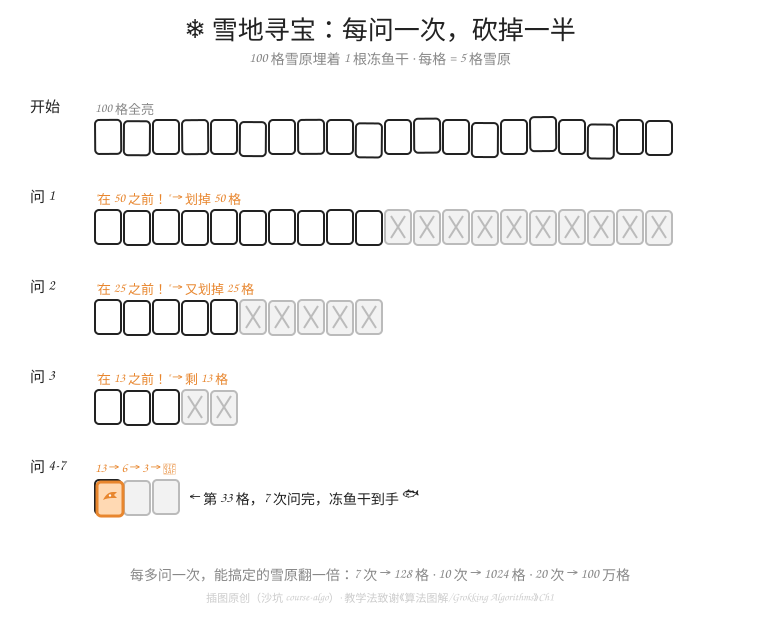

# W13-L01 · 二分查找：每次砍一半（雪地寻宝）

> 用时：30-40 分钟 · 难度：⭐⭐ · 前置：W05（猜数字）+ W08（函数）

---

> **📂 课前准备 · 随堂练习文件**：先在 Thonny `文件 → 新建`，立刻 `文件 → 另存为...` 存为 `~/learning-homework/<你的学员名>/homework/W13-L01-practice.py`（ThawPaw 对应 `thawpaw/homework/`，Tree 对应 `tree/homework/`）。本课所有亲手敲的代码都写进这个文件；课后作业 `W13-L01-homework.py` 是另一个文件，别混。

## 一、先回忆 W05（3 分钟）

W05 你写过猜数字：电脑从 1-100 偷偷想一个数，你来猜，它只说"大了 / 小了"。

**问题：你当时是怎么猜的？**

大多数人不谋而合——**先猜 50**。为什么？因为不管电脑说大了还是小了，你都能**排除掉一半**。

这个"每个聪明的玩家都在用"的本能，就是今天的主角：**二分查找（binary search）**。它是人类发明的最有用的算法之一，从这周开始，我们把本能升级成武功。

## 二、雪地寻宝（10 分钟）

猫武士场景：100 格长的雪原里，埋着 1 根冻鱼干（编号 1-100 的某格）。你只能问"它在第 X 格之前还是之后？"——每问一次，**一半雪原被划掉**。



跟着图走一遍，把表填完（亲手填，这是今天的核心练习）：

| 第几次问 | 剩下范围 | 划掉多少格 |
|---|---|---|
| 开始 | 1-100（100 格） | — |
| 1 | 1-50 | 50 格 |
| 2 | 26-50 | 25 格 |
| 3 | 26-38 | 12 格 |
| 4 | 33-38 | 6 格 |
| 5 | 33-35 | 3 格 |
| 6 | 33-34 | 1 格 |
| 7 | 33 | 🎯 命中 |

**7 次，必中。** 不管冻鱼干埋在哪，最多 7 问。

## 三、为什么偏偏是 7（5 分钟）

每问一次砍一半：100 → 50 → 25 → 12 → 6 → 3 → 1。

反过来想：砍 7 次"只剩 1 格"，需要一开始有多少格？在 Shell 里验证：

```python
>>> 2 ** 7
128
```

2⁷ = 128 > 100，所以 7 次足够。**每多问一次，能搞定的雪原翻一倍**：7 次→128 格，10 次→1024 格，20 次→**一百多万格**。

对比一下"逐格搜"：

| 雪原大小 | 逐格搜（最坏） | 每次砍半（最坏） |
|---|---|---|
| 100 格 | 100 次 | 7 次 |
| 1,000 格 | 1,000 次 | 10 次 |
| 1,000,000 格 | 1,000,000 次 | 20 次 |

逐格搜涨得像爬楼梯，砍半几乎不动——这就是好算法和笨办法的差距。

## 四、二分的两个前提（5 分钟）

砍半不是随便砍的，它有两个前提，比算法本身还重要：

1. **必须有序**。词典里查 cat，没人从第一页翻起——因为词典**按字母排好序**了，你才知道往前往后。冻鱼干游戏里"之前还是之后"能成立，也是因为格子**有编号**。
2. **必须能直接跳到中间**。词典能随手翻到大概中间的位置；一卷只能从头展开的羊皮纸就不行（哪怕内容有序）。

记住这句话：**无序，先排序；不能跳，砍不了。**

## 五、动手练习（先做完，再看第六节答案）

1. 把第二节的表格亲手抄一遍填完（不看答案）
2. 雪原变成 1-200 格，最少几次必中？用 `2 ** n` 在 Shell 里验证
3. 1-1000 格呢？
4. 反过来：最多问 5 次，最多能应付多少格的雪原？
5. 🚀 加速挑战：查词典（纸质或电子都行）找单词 `warrior`。记下你翻了几次"砍半"找到的，和"从第一页逐页翻"需要几次比一比

## 六、练习答案（先做再看！）

**1.** 填表见第二节，第 7 次命中。

**2.** 200 格：2⁷=128 不够，2⁸=256 ≥ 200 → **8 次**。

**3.** 1000 格：2⁹=512 不够，2¹⁰=1024 ≥ 1000 → **10 次**。

**4.** 5 次 → 2⁵ = **32 格**。注意规律：问的次数 +1，能耐 ×2。

**5.** 开放题。纸质词典查 warrior 大约 8-10 次砍半就能锁定页码区域；逐页翻可能要翻几百页——你已经每天都在用二分查找了，只是今天才叫出它的名字。

## 七、🤖 AI 常识胶囊 · 第 1 颗：AI 不是魔法（3 分钟）

> 从这周起，每课结尾加一颗「AI 常识胶囊」：一颗讲一个 AI 概念 + 两道判断题。清华附 AI 营线上考有 20 道判断题（AI 常识类），咱们每课攒一点手感。

今天的课说：好算法和笨办法差距巨大。那 **AI（比如 DeepSeek 这样的对话大模型）** 靠什么厉害？

答案不玄：**算法 + 数据**。

- **算法**：人想出来的招——就像今天的二分，每问一次砍一半
- **数据**：AI 读过的书——训练时"喂"给它的海量文字，喂什么长什么

AI 没有魔法，它底下跑的还是招数，只是招数更复杂、读的数据更多。

**⚔️ 判一判（先自己答，再看答案）**

1. AI 比人聪明，所以它说的话一定是对的。
2. AI 大模型的知识，来自它训练时"读"过的数据。

**答案**：1 ✗（AI 会"一本正经地胡说"，行话叫**幻觉**——它是按学过的规律猜下一个词，不是在查百科全书）；2 ✓（喂什么长什么，数据的质量决定 AI 的水平）。

## 八、👀 C++ 认脸时刻（1 分钟 · 只看不敲）

> AI 营笔试的编程题用 C++ 出。不用会写，**认得脸**就行：每课课尾放一段和本课同款的 C++，扫一眼混脸熟。

今天的 `2 ** 7`，C++ 长这样：

```cpp
#include <iostream>          // 认脸①：C++ 开工前先"领工具箱"（Python 不用）
int main() {                 // 认脸②：C++ 的代码住在 main 这个"房子"里
    std::cout << (1 << 7);   // 认脸③：cout << 是"打印"；1 << 7 = 2 的 7 次方
    return 0;
}
```

彩蛋：`<<` 在 `cout <<` 里是"打印"，在 `1 << 7` 里是"左移翻倍"——同一个符号打两份工，C++ 的老传统。

## 九、自查清单

- [ ] 我能不看笔记说出二分查找的两个前提（有序 + 能跳到中间）
- [ ] 我能填出 1-100 的 7 步追踪表
- [ ] 我会用 `2 ** n` 算"几次够用"
- [ ] 练习 5 题全部完成，答案对过
- [ ] 🚀 加速挑战完成（全员必做，mentor 打分）
- [ ] 🤖 AI 胶囊第 1 颗拿下：判断题 2 道全对，能说出 AI 的两个原料（算法 + 数据）

全勾 → 进入 W13-L02「猜数字 2.0：把本能写成代码」。

> 📚 配套阅读：《算法图解》第 1 章 1.2 节「二分查找」（手绘版猜数字演示，和今天的雪地寻宝异曲同工）
