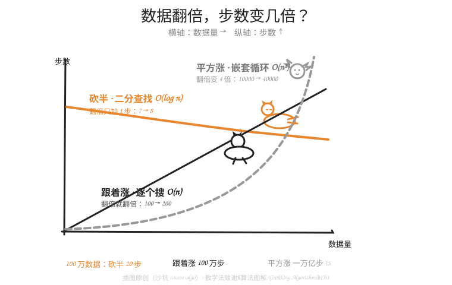

# W13-L03 · 快慢的度量：数据翻倍，时间变几步

> 用时：30-40 分钟 · 难度：⭐⭐⭐ · 前置：W13-L01 + W13-L02

---

> **📂 课前准备 · 随堂练习文件**：先在 Thonny `文件 → 新建`，立刻 `文件 → 另存为...` 存为 `~/learning-homework/<你的学员名>/homework/W13-L03-practice.py`。本课所有亲手敲的代码都写进这个文件；课后作业 `W13-L03-homework.py` 是另一个文件，别混。

## 一、问题：怎么比较两个算法谁快（3 分钟）

L02 里逐格搜找 `vole` 用 6 步、二分用 3 步——差 3 步，好像没什么？

但快慢**不是数步数，是看步数怎么涨**。就像比两个孩子的身高，不看现在几厘米，看**每年长几厘米**。算法界有一把专用的尺子，今天我们拿直觉版（正式名字叫**大 O 记号**，Big O，先混个脸熟，不用背符号）。

## 二、翻倍问题：最好用的直觉尺（10 分钟）

问法统一成一句：**数据翻倍，步数变几倍？**

| 算法 | 数据翻倍时 | 直觉名字 | 大 O 名字（混脸熟） |
|---|---|---|---|
| 逐格搜 | 步数**翻倍**（100→200 步） | 跟着涨 | O(n) |
| 二分查找 | 步数**只加 1**（7→8 步） | 几乎不涨 | O(log n) |
| 嵌套循环（W04 画九九乘法表） | 步数**翻 4 倍**（100²→200²） | 疯狂涨 | O(n²) |



看图记住三个形状（不用记坐标轴数字）：

- **几乎不涨**（二分）：像趴着的猫——数据涨到天上去，它也就多伸个懒腰
- **跟着涨**（逐个搜）：像走的猫——数据走多远它走多远
- **疯狂涨**（嵌套循环）：像炸毛的猫——数据才翻倍，它已经窜上天花板

## 三、亲手验证，别信我（10 分钟）

口说无凭，跑数字。三个函数，同一份数据，各数各的步数：

```python
def count_slow_search(n):
    """逐格搜：在最坏情况（目标在最后/不存在）走 n 步"""
    return n

def count_binary_search(n):
    """二分：不断除 2 直到 1，数一共除了几次"""
    steps = 0
    while n > 1:
        n = n // 2
        steps = steps + 1
    return steps

def count_nested_loops(n):
    """嵌套循环：外层 n 次 × 内层 n 次"""
    return n * n

for n in [100, 200, 1000, 1000000]:
    print(f"数据量 {n:>9}：逐个 {count_slow_search(n):>9} 步 | "
          f"二分 {count_binary_search(n):>2} 步 | 嵌套 {count_nested_loops(n):>12} 步")
```

运行前**先预测**每一列，再对答案。重点盯两处：

- 100→200（翻倍）：逐个从 100 变 200（翻倍）；二分从 7 变 8（**只加 1**）；嵌套从 10000 变 40000（翻 4 倍）
- 到 100 万：逐个要 100 万步，嵌套要**一万亿**步，二分还是 **20** 步

## 四、三句话口诀（5 分钟）

1. **砍半的，几乎不涨**（O(log n)）：二分查找
2. **遍历的，跟着涨**（O(n)）：逐个搜、一遍 for
3. **套娃循环，平方涨**（O(n²)）：for 里再套 for（W04 嵌套循环、冒泡排序都是）

以后每次写程序，养成一个新习惯：**扫一眼有没有 for 套 for**。有，警铃响一下——数据大的时候它会第一个炸毛。

## 五、动手练习（先做完，再看第六节答案）

1. 跑第三节的代码，把输出表抄在纸上，用三种颜色描出三列的增长形状
2. 预测：数据量 400 时，逐个 / 二分 / 嵌套各几步？算完用代码验证
3. 下面三个"程序日常"哪个是砍半、哪个是跟着涨、哪个是平方涨？
   - a. 在 100 页的点名册里按顺序找最后一个名字
   - b. 猜 1-1000 的数字，每次猜中间
   - c. 全班 40 人两两握手一次，一共握几次
4. W04 的九九乘法表打印了多少次 `print`（内层加起来）？它是几乘几？
5. 🚀 加速挑战：给 `count_binary_search` 加一句 `print`，把 100 万被 2 除到 1 的全过程打出来（500000, 250000, 125000, ...），亲眼看着它塌下去

## 六、练习答案（先做再看！）

**1.** 表格形状：直线上升 / 几乎水平 / 火箭上升。

**2.** 逐个 400 步；二分 9 步（256→512 之间，log₂400≈8.6 往上取整）；嵌套 160000 步。

**3.** a = 跟着涨 O(n)；b = 砍半 O(log n)；c = 平方涨 O(n²)（40×39÷2≈780 次，握手问题和嵌套循环同宗——每人都要和其它每人配一次）。

**4.** 9+9×9……准确数：外层 1-9，内层跑到外层行号，共 1+2+…+9 = 45 次。它不是完整的 n²，是 n² 的"一半"（三角形），但增长脾气和 n² 一家——数据翻倍照样翻 4 倍附近。**看增长脾气，不看精确步数**，这正是大 O 的思想。

**5.** 循环里加 `print(n)` 即可。100 万 → 50 万 → 25 万 → … → 1，一共 19 行。20 步封顶（第一次比较也算一步），和 2²⁰=1048576 > 100 万 对上了。

## 七、自查清单

- [ ] 我能用"翻倍问题"判断一个算法是砍半 / 跟着涨 / 平方涨
- [ ] 我亲手跑过三列对比表，见过 100 万 vs 20 的差距
- [ ] 我看到 for 套 for 会本能警铃一响
- [ ] 练习 5 题全部完成，答案对过
- [ ] 🚀 加速挑战完成（全员必做，mentor 打分）

全勾 → 进入 W13-weekend「词典寻宝赛 + 读程序挑战」。

> 📚 配套阅读：《算法图解》第 1 章 1.3 节「大 O 表示法」（那三条曲线的官方原版画风）
